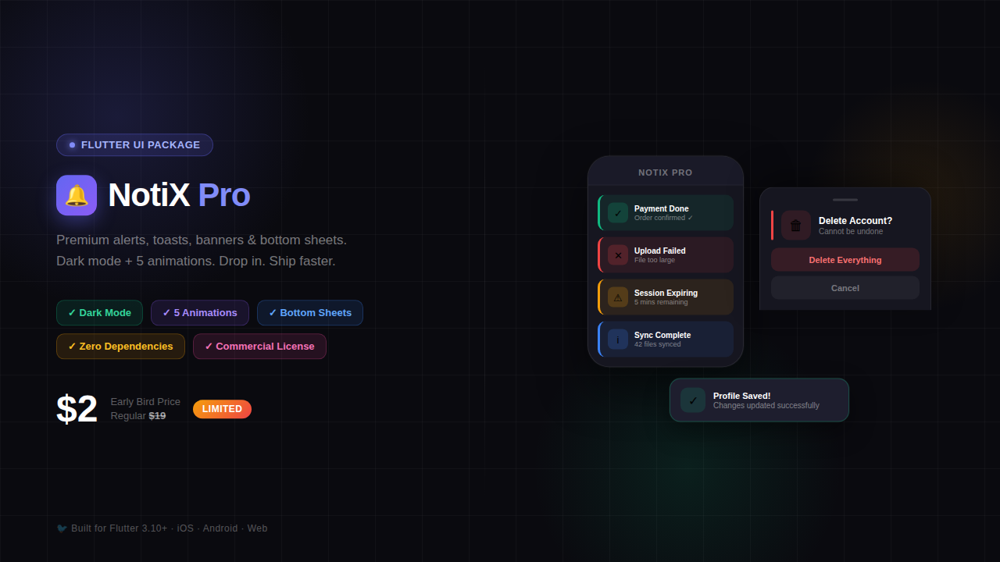
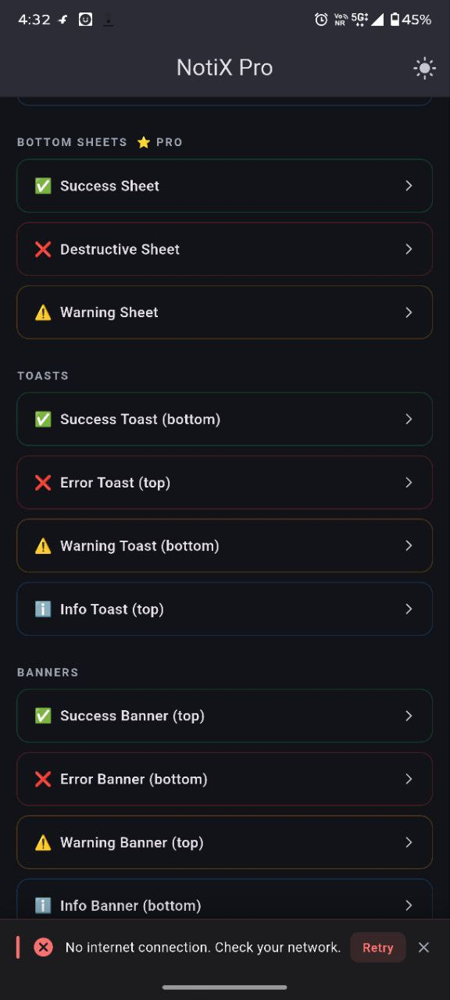
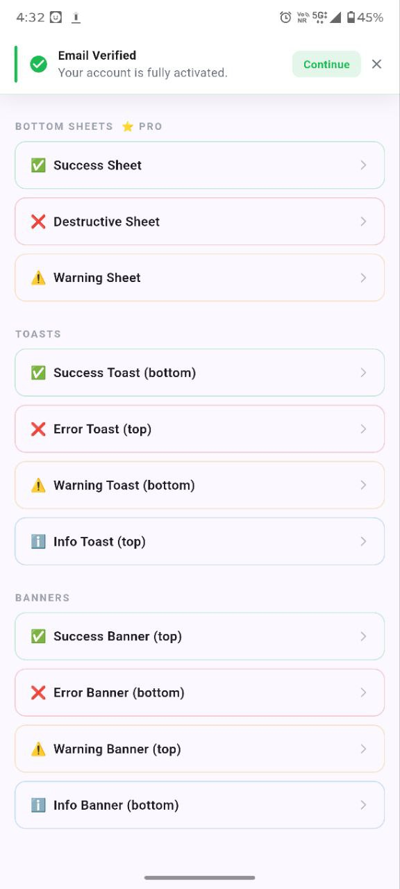
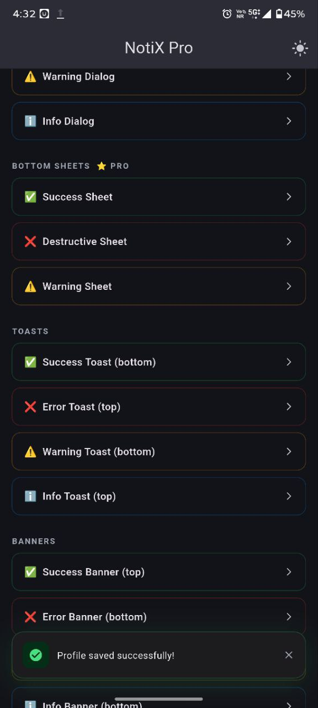
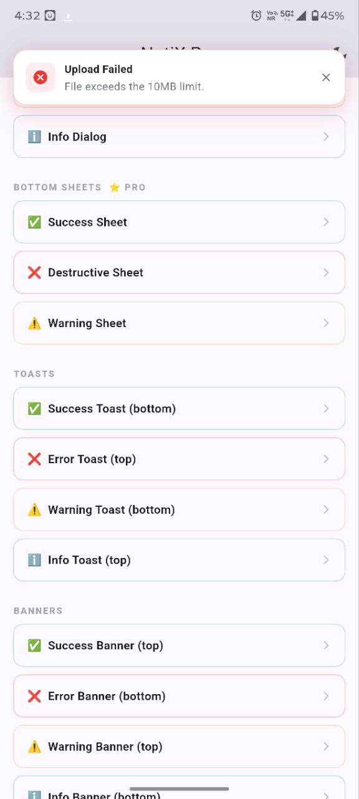
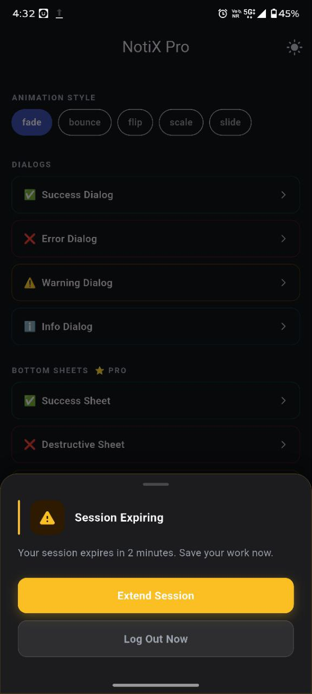
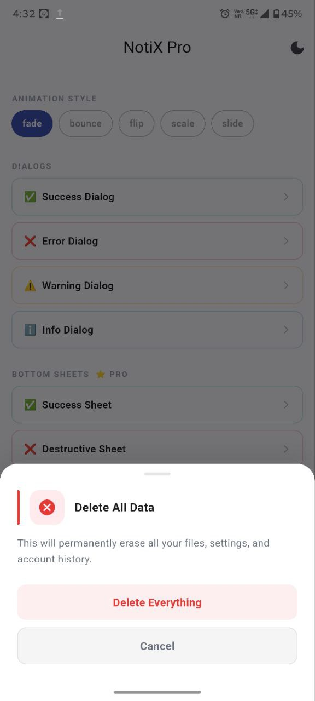
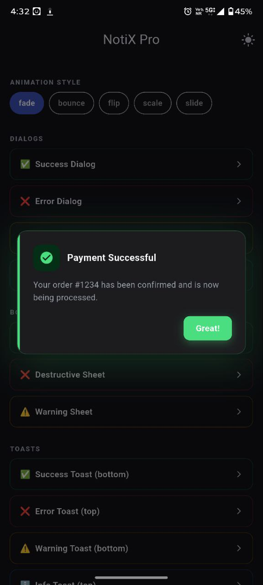
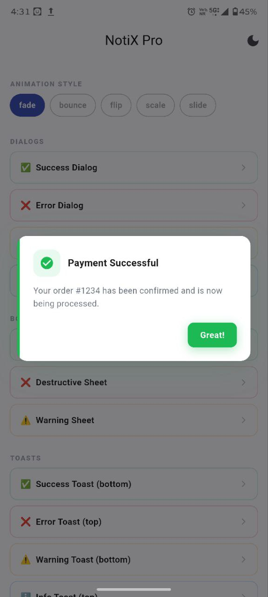

# Notix Pro

<p align="center">
  
</p>

Premium Flutter notification kit with **dark mode, 5 animation styles, bottom sheets, toasts, banners, and dialogs**.

---

## ✨ Features

- ✅ **NotixDialog** – animated popup alerts with dark mode + animations  
- ✅ **NotixToast** – floating toast notifications (top or bottom)  
- ✅ **NotixBanner** – full-width banner notifications with action button  
- ✅ **NotixSheet** – bottom sheet alerts with multiple actions (PRO)  

### 🎨 Built-in Capabilities

- 🌙 **Auto dark mode detection**
- 🎬 **5 animation styles**
  - bounce
  - flip
  - blur
  - slide
  - scale
- 🎨 **4 alert types**
  - success
  - error
  - warning
  - info
- 💡 **Zero dependencies**

---

## 📸 Screenshots

<p float="left">
  
  
  
  
</p>

<p float="left">
  
  
  
  
</p>

---

## 📦 Installation

Add this to your `pubspec.yaml`:

```yaml
dependencies:
  notix_pro: ^0.0.2